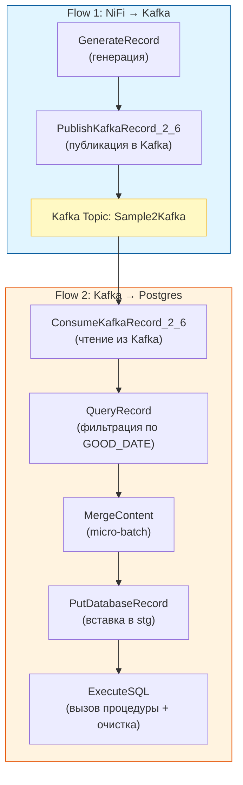

# Гайд для менти: как работают примеры flow на JSON (NiFi → Kafka → Postgres)

> **Последнее обновление:** 2026-01-08 | **Версия NiFi:** 1.x.x | ← [Вернуться в README](README.md)

Этот гайд про два flow definition файла:
- `nifi-templates/Sample2Kafka.json` — генерирует записи и публикует их в Kafka topic `Sample2Kafka` в виде JSON.
- `nifi-templates/SampleKafka2Postgres.json` — читает JSON из Kafka topic `Sample2Kafka` и пишет данные в Postgres.

## 0) Что мы строим (общая картинка)
Цепочка очень простая:
1) NiFi генерирует запись (как “строчку данных”).
2) NiFi отправляет эту запись в Kafka (как сообщение в topic).
3) Другой flow в NiFi читает эти сообщения из Kafka.
4) NiFi фильтрует/готовит данные и вставляет их в Postgres.

Это учебный пример, который показывает базовые роли технологий:
- **NiFi** — визуальный конвейер (pipeline) данных.
- **Kafka** — "почтовый ящик"/шина сообщений между системами.
- **Postgres** — база данных, где данные хранятся и доступны SQL-запросами.

### Визуализация потока данных



## 1) Мини-словарь NiFi (3 понятия)
- **FlowFile** — “сообщение”, которое течёт по графу. У FlowFile есть *content* (тело) и *attributes* (метаданные).
- **Processor** — шаг обработки (прочитать/преобразовать/записать).
- **Controller Service** — общая настройка, которую используют процессоры (например, “как читать JSON” или “как подключаться к базе”).

## 2) Какой JSON у нас в примере
Запись состоит из двух полей:
- `dttm` — дата/время (timestamp).
- `txt` — строка (text).

Пример JSON-записи:
```json
{
  "dttm": "2026-01-08T11:49:52Z",
  "txt": "Пример текста"
}
```

В первом flow запись создаётся процессором `GenerateRecord` по схеме (она задана в настройке процессора).

Важно: в этом учебном варианте **мы не используем Avro** и не используем Schema Registry. Сообщения в Kafka — это обычный JSON.

## 3) Перед стартом: что проверить
1) Стенд поднят: `docker compose up -d`
2) Открывается NiFi: http://localhost:18443/nifi/
   > 💡 **Примечание:** В текущей конфигурации аутентификация отключена для упрощения обучения. Логин и пароль не требуются.
3) Открывается Kafka UI: http://localhost:8082/
4) **Примените SQL-скрипт для демо-таблиц** (требуется при первом запуске стенда или после `docker compose down -v`):
   - `docker compose exec -T postgres psql -U postgres -d app -f /nifi-templates/SampleKafka2Postgres.sql`
   
   > ⚠️ **Важно:** Скрипт не идемпотентный — при повторном запуске будут ошибки про существующие схемы/таблицы.

## 4) Flow 1 — `Sample2Kafka.json` (NiFi → Kafka)
Цель: регулярно публиковать новые JSON-сообщения в Kafka topic `Sample2Kafka`.

### Шаги внутри flow
1) `GenerateRecord`
   - Создаёт запись по схеме (в настройке `schema-text`).
   - Частота генерации задаётся расписанием процессора (например, раз в 2 секунды).
2) `PublishKafkaRecord_2_6`
   - Берёт записи и публикует в Kafka.
   - Важные настройки:
     - `bootstrap.servers`: `kafka:29092` (имя сервиса внутри Docker).
     - `topic`: `Sample2Kafka`
     - `record-reader`: `JsonTreeReader` (как “прочитать запись” перед отправкой)
     - `record-writer`: `JsonRecordSetWriter` (как сериализовать в JSON)

### Как проверить, что flow работает
- В NiFi у `PublishKafkaRecord_2_6` растёт счётчик “out”.
- В Kafka UI в topic `Sample2Kafka` появляются сообщения.

Если сообщений нет:
- Проверьте, что процессоры запущены и нет очереди/ошибок на `failure`.
- Проверьте, что внутри NiFi указано `kafka:29092`, а не `localhost:9092`.

## 5) Flow 2 — `SampleKafka2Postgres.json` (Kafka → Postgres)
Цель: читать сообщения из `Sample2Kafka`, отфильтровать записи и записать их в Postgres.

### Шаги внутри flow
1) `ConsumeKafkaRecord_2_6`
   - Читает сообщения из Kafka topic `Sample2Kafka`.
   - Важные настройки:
     - `bootstrap.servers`: `kafka:29092`
     - `topic`: `Sample2Kafka`
     - `record-reader`: `JsonTreeReader` (как разобрать JSON из Kafka)
2) `QueryRecord`
   - Выполняет простой “фильтр” по данным.
   - В примере есть запрос `GOOD_DATE` (это имя relationship), который отбирает записи по условию на `dttm`.
   - На выходе получаются записи, которые прошли фильтр.
3) `MergeContent` (micro-batch)
   - Собирает несколько FlowFile в "пачку" перед загрузкой в БД.
   - Зачем: много маленьких вставок (каждое сообщение → отдельный insert) может перегружать БД; batching снижает накладные расходы.
   - Важные настройки:
     - `Minimum Number of Entries`: `100` — минимальный размер пачки
     - `Maximum Number of Entries`: `1000` — максимальный размер пачки
     - `Max Bin Age`: `30 seconds` — максимальное ожидание, чтобы пачка всё равно отправилась даже если данных мало
   - Компромисс: чем больше batch, тем меньше нагрузка на БД, но больше задержка (latency).
4) `PutDatabaseRecord`
   - Вставляет записи в таблицу `stg.samplekafka2postgres`.
   - Использует подключение к Postgres через `DBCPConnectionPool`.
5) `ExecuteSQL`
   - Вызывает хранимую процедуру `ods.load_samplekafka2postgres()` и чистит staging.
   - Это шаг “переложить в витрину/ODS”, чтобы показать типичный паттерн.

### Как проверить результат в Postgres
В контейнере Postgres выполните:
- `docker compose exec -it postgres bash -c \"export PGPASSWORD=postgres; psql -U postgres -d app\"`

И затем SQL:
- `select * from ods.samplekafka2postgres order by id desc limit 10;`

Если таблица пустая:
- Убедитесь, что в Kafka действительно есть сообщения (проверьте Kafka UI).
- Посмотрите, нет ли ошибок на `parse.failure` (у Kafka consumer) или `failure` (у DB).

## 6) Типовые проблемы (и куда смотреть)
- **В NiFi указали `localhost` вместо имени сервиса**: из контейнера `localhost` — это сам контейнер, не Kafka/Postgres.
- **Controller Services выключены**: внутри process group откройте `Controller Services` и включите нужные сервисы.
- **Нет таблиц/процедуры**: после “чистого сброса” нужно снова выполнить `SampleKafka2Postgres.sql`.

## 7) Мини-упражнения для закрепления (5–10 минут)

1) **Изменить частоту генерации**
   - В `Sample2Kafka.json` поменяйте расписание `GenerateRecord` (например, 2 sec → 5 sec) и проверьте скорость появления сообщений в Kafka UI.

2) **Изменить фильтр**
   - В `QueryRecord` измените фильтр `GOOD_DATE` (например, более жёсткое/мягкое условие) и проверьте, как меняется количество строк в Postgres.

3) **Добавить новое поле (расширенное упражнение)**
   - Добавьте новое поле в схему `GenerateRecord` и протащите его до Postgres.
   - После изменения не забудьте обновить SQL-схему/таблицы.
   - *Подсказка:* потребуются изменения в схеме JSON, настройках процессоров и SQL-скрипте.
